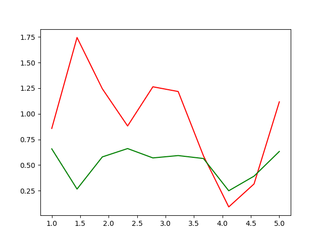

# Generative-Adversarial-Networks
this is an attempt to implement algorithms given in the paper https://arxiv.org/pdf/1701.00160.pdf 

Implementation of Maximum Likelihood estimation
    this is a principle on which a class of generative models function. Given a sample of data points, belonging to a fixed member of a random distribution,
    the goal is to find that distribution. This is found out by maximizing the likelihood or the log likelihood of the function.
    code can be found in the file MaximumLikelihoodEstimation.py
    
    
    Results 
    
    

